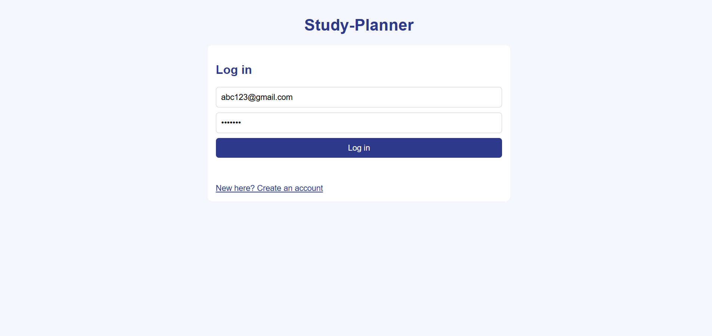
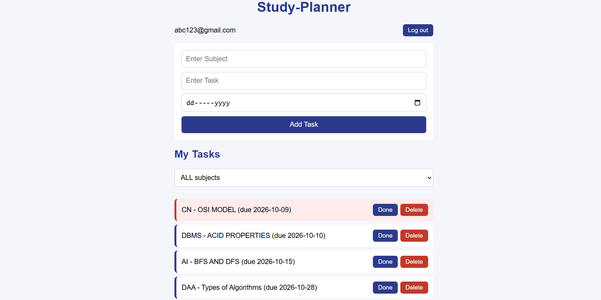
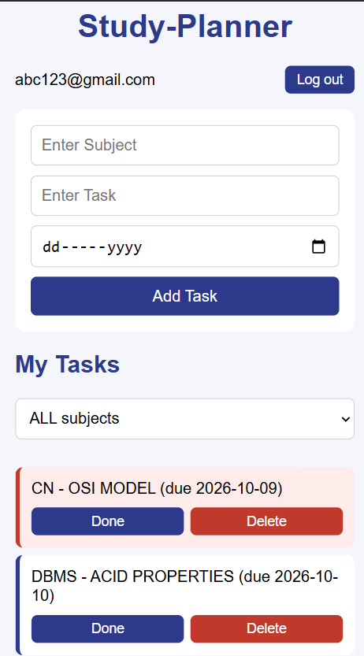

# Study Planner

A full-stack web app where students sign up, log in and keep track of their subjects, tasks and deadlines.

## Features
- Sign up, log in and log out (passwords hashed with bcrypt, login kept with a session cookie)
- Every user sees only their own tasks
- Add tasks with a subject and a deadline
- Mark tasks as done (or undo) and delete them
- Overdue tasks are highlighted in red
- Tasks are sorted by deadline
- Filter tasks by subject
- Responsive layout that works on mobile

## Screenshots




## Tech stack
- **Frontend:** HTML, CSS, JavaScript (no frameworks)
- **Backend:** Node.js, Express
- **Database:** SQLite
- **Auth:** express-session, bcryptjs

## API
| Method | Route | What it does |
|---|---|---|
| POST | /api/signup | create an account |
| POST | /api/login | log in |
| POST | /api/logout | log out |
| GET | /api/me | who is logged in |
| GET | /api/tasks | list my tasks |
| POST | /api/tasks | add a task |
| PUT | /api/tasks/:id | mark done / undo |
| DELETE | /api/tasks/:id | delete a task |

## Run it locally
```
git clone https://github.com/Vedant-99/study-planner.git
cd study-planner
npm install
npm run dev
```
Then open http://localhost:4000

## What I learned
## What I learned

- **Frontend basics:** I built the whole UI with HTML, CSS and plain JavaScript (no framework). I learned how to change the page with the DOM, and how to make it work on phones with media queries.
- **Backend with Node and Express:** I moved from localStorage to a real server. I built a REST API (GET, POST, PUT, DELETE) and learned what status codes like 400, 401, 404 and 409 mean.
- **Database:** I used SQLite to store data permanently. I learned to use parameterized queries (`?`) so users can't inject SQL.
- **Authentication:** I added signup and login. Passwords are hashed with bcrypt (never stored as plain text), and sessions are kept with cookies.
- **Privacy:** Every task belongs to a user. The server checks the `user_id` on each request, so one user can't see or delete another user's tasks.
- **Debugging:** I fixed real bugs: a typo in a function name, a missing `/` in a route, and unsaved files. I learned to read the browser console and the terminal errors.
- **Git and GitHub:** I made small commits with clear messages (feat, fix, style, docs) and pushed them to GitHub.

## Known limitations and ideas
- Sessions are kept in memory, so restarting the server logs everyone out
- Ideas: edit a task, reminders for tasks due soon, dark mode